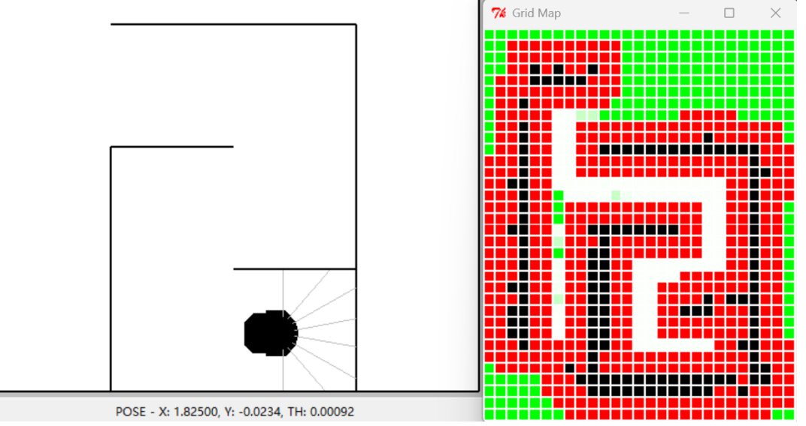

# 🤖 MIT EECS 6.01 - 实验代码库

🌟 **这是 MIT-EECS-6.01 部分实验代码，上机效果良好！**

  
  
图 1: 状态机

✨ 本项目基于 Python 2.6 开发。部分实验依赖于课程官方提供的 lib601 库，请确保将其放置在 Python 环境变量或项目根目录中

erDiagram
    DEPARTMENT ||--o{ ADMIN : "归属"
    ADMIN ||--o{ ADMIN_PRIV : "拥有"
    ADMIN ||--o{ NOTE : "创作"
    ADMIN ||--o{ CATEGORY : "管理"
    ADMIN ||--o{ CHAT_MESSAGE : "对话"
    ADMIN ||--o{ LOGIN_LOG : "产生"
    NOTE ||--o{ NOTE_CATEGORY_RELATION : "关联"
    CATEGORY ||--o{ NOTE_CATEGORY_RELATION : "关联"

    ADMIN {
        int id PK
        string user_code UK
        string name
        string department
    }

    NOTE {
        long id PK
        long user_id FK
        string title
        string content
        string summary
        boolean deleted
    }

    CATEGORY {
        long id PK
        long user_id FK
        string category_name
    }

    NOTE_CATEGORY_RELATION {
        long id PK
        long note_id FK
        long category_id FK
    }

    CHAT_MESSAGE {
        long id PK
        long user_id FK
        string session_id
        string role
    }

    DEPARTMENT {
        int id PK
        string department_name
    }

    ADMIN_PRIV {
        int id PK
        int admin_id FK
        string mod_id
        string priv
    }

    LOGIN_LOG {
        long id PK
        string user_code
        string ip_address
        string name
    }
